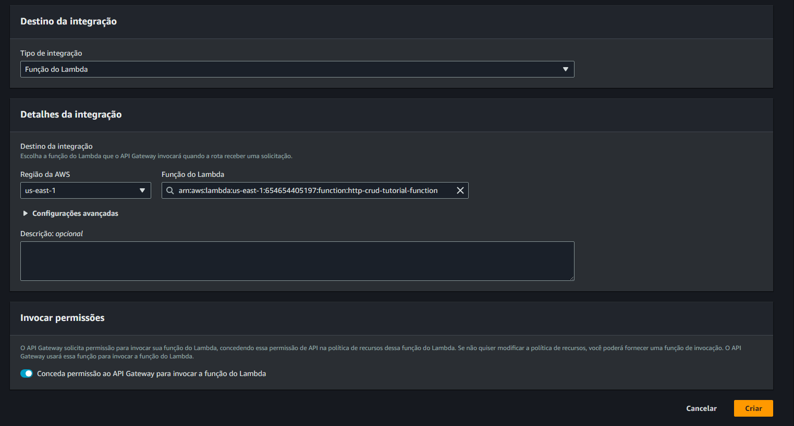

# Build your first CRUD API in 45 minutes or less!

Um workshop de como criar uma API com as operações **C**REATE, **R**EAD, **U**PDATE** e **D**ELETE para interagir com itens de um banco de dados. <br>
A API será serverless utilizando recursos da AWS, como DynamoDB, HTTP API Gateway e função Lambda.

## Criar tabela no DynamoDB

1. Acesse o console DynamoDB
2. Escolha a opção de criar tabela
3. Nome da tabela: ```http-crud-tutorial-items```
4. Chave de partição: ```id```, tipo String
5. Configurações padrão


## Criar função Lambda

1. Acesse o console Lambda
2. Escolha criar função
3. Para o nome da função, escolha ```http-crud-tutorial-function```
4. Utilizaremos Node.js 16.x, caso escolha versões mais atuais pode precisar alterar o código.
5. Na aba permissões, crie uma nova função ```http-crud-tutorial-role``` e escolha Permissões simples de Microserviços.


6. Faça as alterações do código de acordo com o arquivo [index.js](index.js) e clique em Deploy


## Criar HTTP API

1. Acesse o console API Gateway
2. Escolha criar API HTTP
3. Clique em compilar


4. Coloque o nome ```http-crud-tutorial-api```, e prossiga, criaremos as rotas depois


5. Abra o API Gateway e selecione sua API
6. Clique em Criar na aba de rotas


7. Crie rotas para:
   1. GET ```/items/{id}```
   2. GET ```/items```
   3. PUT ```/items```
   4. DELETE ```/items/{id}```


## Integração

1. Acesse a aba de integrações, no API Gateway.
2. Crie uma integração, do tipo função Lambda e escolha a função criada neste exercício



3. Anexe a função Lambda a cada rota de sua API


## Testar a API

Podem ser usados diversas plataformas para o teste, como por exemplo a Cloud9 da própria AWS.
Neste exercício usaremos Postman.

1. Pegue a URL de sua API
2. Faça requisições PUT com o seguinte JSON

```JSON
{
    "id": "abcdef236",
    "price": 12345,
    "name": "myitem2"
}
```


3. Insira mais itens com IDs diferentes
4. Agora faça uma requisição do tipo GET na rota ```/items```


5. Busque um item por ID em ```/items/{id}```


6. Delete um item


7. Confira com o GET


8. Atualize um item, fazendo um PUT novamente no mesmo ID


9. Confira com o GET


## Finalizando

Não se esqueça de apagar a API, a tabela do banco de dados e a função Lambda para evitar cobranças desnecessárias.
Também apague a função IAM (```http-crud-tutorial-role```) criada para a função Lambda e o grupo de Logs no CloudWatch.